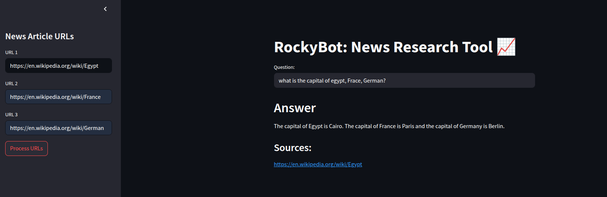
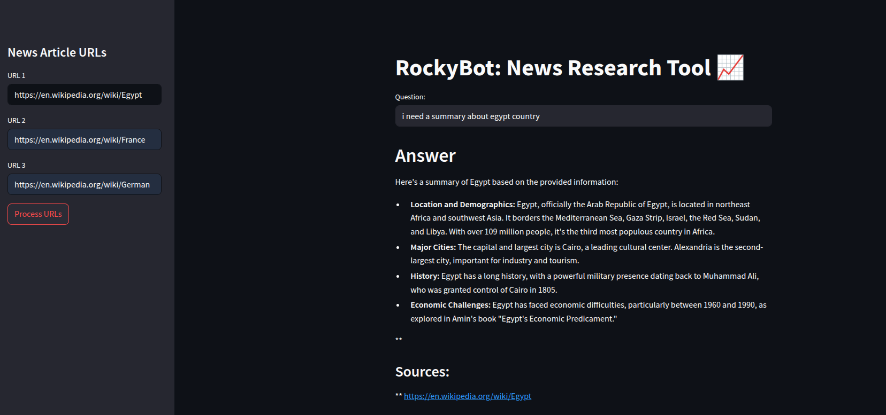
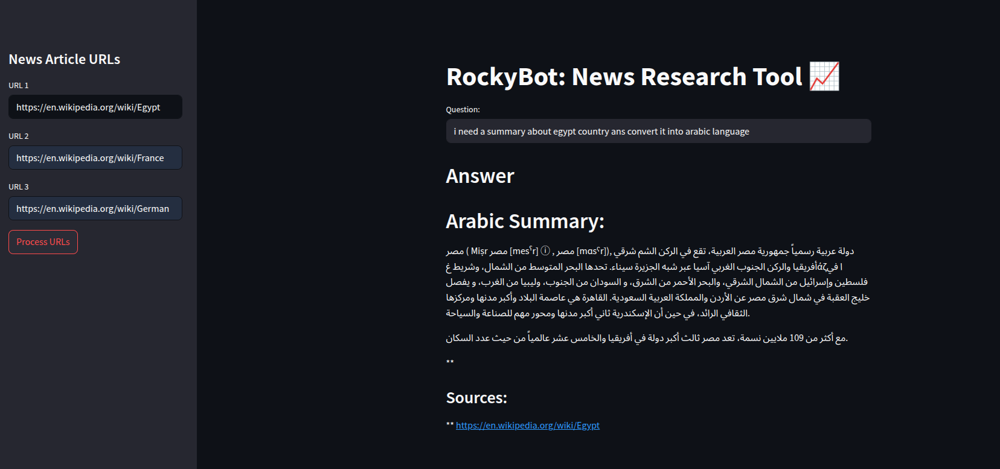

# 📰 RockyBot: News Research Tool 📈

The **News Research Tool** project is designed to accept up to three different document links. It can answer questions about these documents, summarize them, and translate their content.

## ✅ Technologies Used

### 🖥️ Frontend & Deployment
- **Streamlit**  
  Used for building the user interface and deploying the app as a web-based tool.

---

### 🧠 LLM (Large Language Model) & Orchestration
- **LangChain**  
  Orchestrates the interaction between the language model, vector store, document loader, and chain execution.

- **LangChain Community Modules**
  - `UnstructuredURLLoader`: Loads content from news article URLs.
  - `FAISS`: Used for vector storage and similarity search.

- **LangChain Groq Integration**
  - `ChatGroq`: Connects to Groq's hosted LLMs like `gemma2-9b-it`.

---

### 🔍 Embeddings & Vector Search
- **HuggingFace Embeddings**
  - Model: `sentence-transformers/all-MiniLM-L6-v2`  
    Generates vector embeddings from the text data.

- **FAISS (Facebook AI Similarity Search)**  
  Enables fast and efficient similarity search over embedded vectors.

---

### 🧱 Document Processing
- **Text Splitting**
  - `RecursiveCharacterTextSplitter`: Splits long documents into smaller chunks suitable for embedding and retrieval.

---

### 🔐 Environment & Configuration
- **python-dotenv**
  - Loads environment variables and API keys from a `.env` file using `load_dotenv()`.

---

### 📦 Serialization
- **Pickle**
  - Saves and loads the FAISS vector store locally to avoid repeated computation.

---

## 🔄 Workflow Summary

1. User inputs up to 3 news article URLs in the sidebar.
2. Content is scraped using `UnstructuredURLLoader`.
3. Text is split into chunks.
4. Chunks are embedded using a HuggingFace model.
5. Embeddings are stored in FAISS.
6. User enters a question.
7. LangChain routes the query:
    - FAISS retrieves relevant chunks.
    - Groq’s `gemma2-9b-it` LLM answers based on the retrieved context.
8. Final answer and sources are displayed in the UI.

---

## 🌐 Live Demo

Try the app live here:  
🔗 [RockyBot – News Research Tool](https://ahmedayman77-news-research-tool-main-3ph0it.streamlit.app/)
